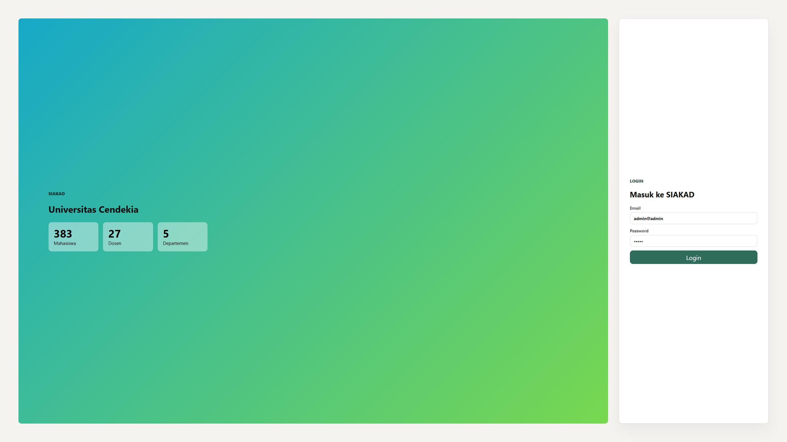
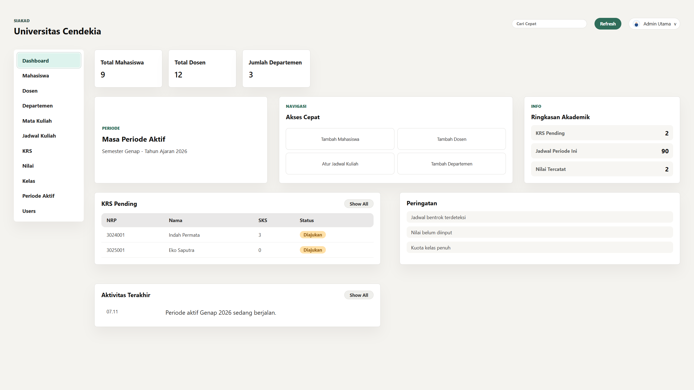
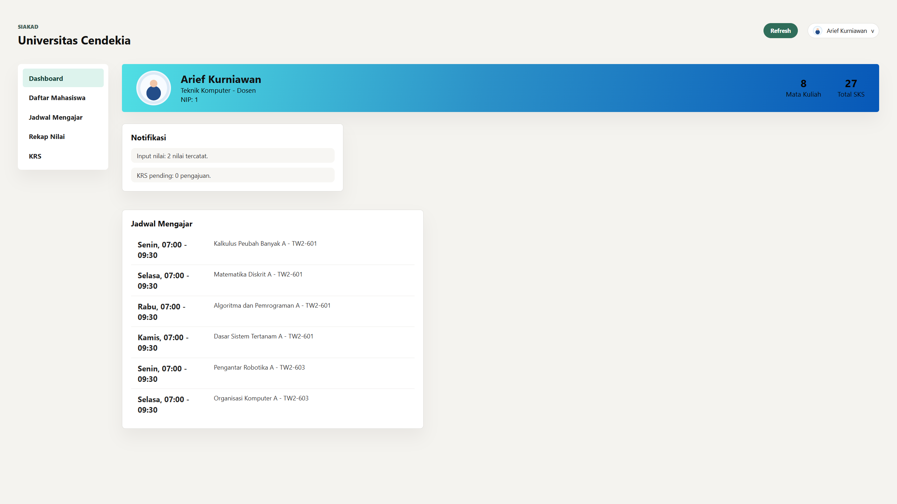
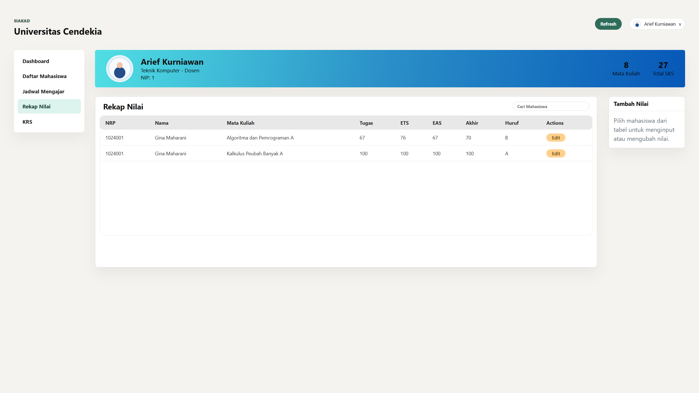
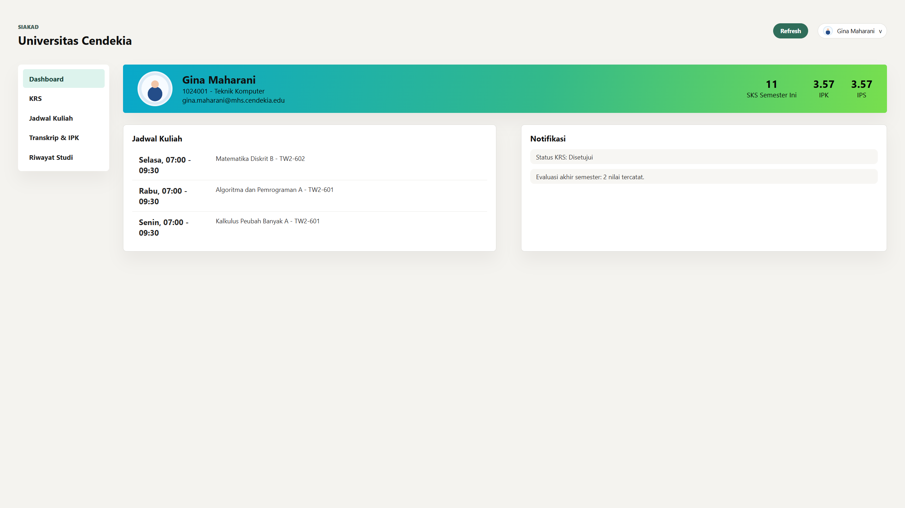
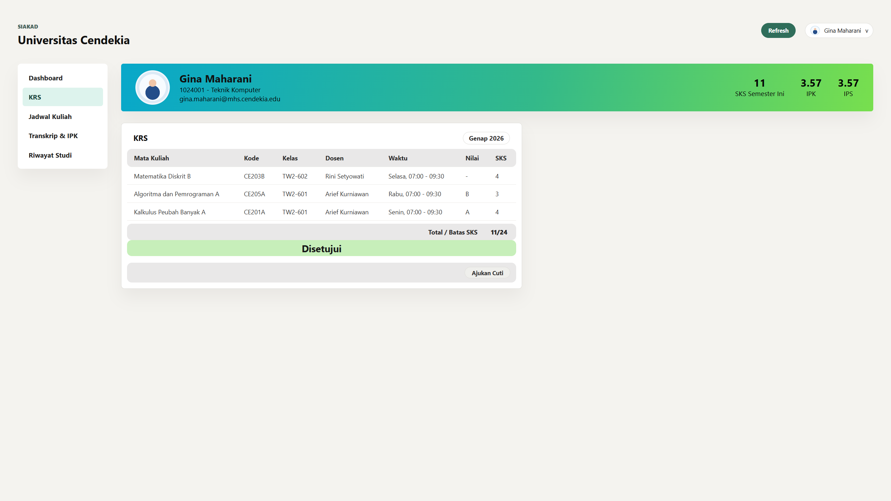
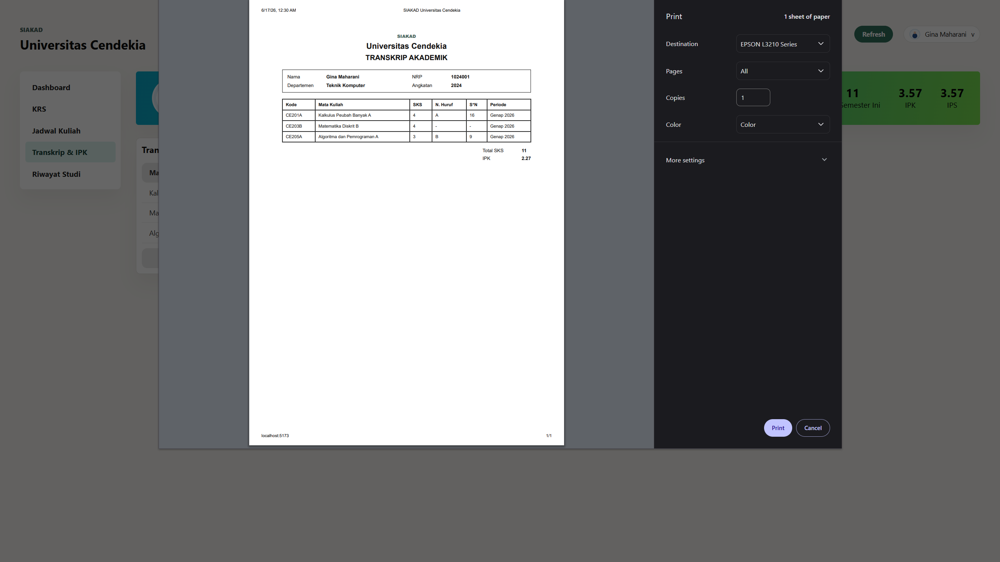

# SIAKAD Universitas Cendekia

SIAKAD Universitas Cendekia adalah aplikasi web sistem informasi akademik untuk mengelola data akademik kampus secara terintegrasi. Sistem ini mendukung tiga peran utama: admin, dosen, dan mahasiswa.

## Fitur Utama

- Login berdasarkan role admin, dosen, dan mahasiswa.
- Admin dapat mengelola data departemen, mahasiswa, dosen, mata kuliah, kelas, jadwal kuliah, KRS, nilai, periode aktif, dan user.
- Dosen dapat melihat mahasiswa wali, jadwal mengajar, KRS mahasiswa, dan menginput nilai.
- Mahasiswa dapat melihat KRS, jadwal kuliah, riwayat studi, transkrip, IPS, dan IPK.
- Filter data berdasarkan departemen, angkatan, periode, dan mata kuliah.
- Perhitungan nilai akhir, huruf mutu, IPS, dan IPK mengikuti data akademik yang tersimpan di database.

## Tech Stack

- Frontend: Svelte, TypeScript, Vite
- Backend: Hono, Node.js, TypeScript
- Database: MySQL
- Package manager: npm

## Struktur Project

```text
SIAKAD-Universitas-Cendekia/
|-- client/             # Frontend Svelte
|-- server/             # Backend Hono + MySQL
|-- docs/images/        # Screenshot dokumentasi
|-- package.json
`-- README.md
```

## Menjalankan Project

### 1. Backend

```bash
cd server
npm install
npm run dev
```

Backend berjalan pada port yang dikonfigurasi di `server/src/index.ts`.

### 2. Frontend

```bash
cd client
npm install
npm run dev
```

Frontend akan berjalan melalui Vite, biasanya di:

```text
http://localhost:5173
```

## Anggota Kelompok

Kelompok 09

| Nama | NRP | Role |
|---|---|---|
| Vinsen Dwi Putra | 5024241094 | Fullstack |
| Sarah Shafira Maulida | 5024241035 | Database |
| Anisa Hasna Mufida | 5024241071 | UI/UX |
| Yoga Andreas Hutajulu | 5024241021 | UI/UX |

## Dokumentasi

### Login



### Admin



### Dosen





### Mahasiswa







### Design Database


